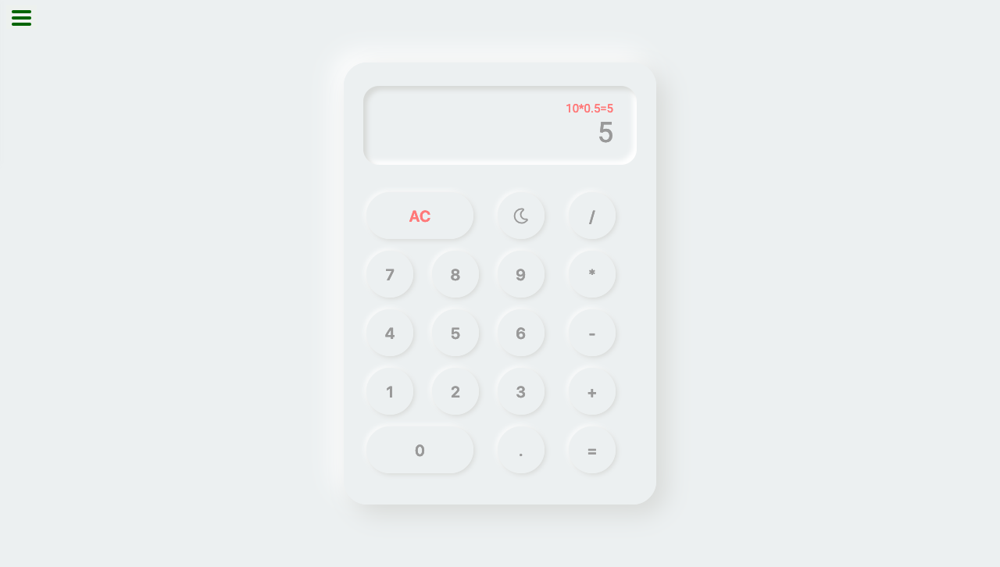

<h1 align="center">React.js Calculator</h1>

<div align="center">
   Solution for a Project from  <a href="https://www.freecodecamp.org" target="_blank">FreeCodeCamp.org</a>.
</div>

<div align="center">
  <h3>
    <a href="https://freecodecamp-calculator.netlify.app/">
      Demo
    </a>
    <span> | </span>
    <a href="https://github.com/Aldhanekaa/React.js-Calculator">
      Solution
    </a>
    <span> | </span>
    <a href="https://www.freecodecamp.org/learn/front-end-libraries/front-end-libraries-projects/build-a-javascript-calculator">
      Challenge
    </a>
  </h3>
</div>

<!-- TABLE OF CONTENTS -->

## Table of Contents

- [Overview](#overview)
  - [Built With](#built-with)
- [Features](#features)
- [How to use](#how-to-use)
- [Contact](#contact)

<!-- OVERVIEW -->

## Overview



- Where can I see your demo?
  You can see the [demo](https://freecodecamp-calculator.netlify.app/) here!
- What was your experience?
  This is my amazing experience, because my problem solving skills was improved and my React.js skills was improved too!
- What have you learned/improved? 
  My problem solving skills was improved
<!-- - Your wisdom? :)
     -->

### Built With

<!-- This section should list any major frameworks that you built your project using. Here are a few examples.-->

- [React.js](https://reactjs.org/)
- [Sass | Scss](https://sass-lang.com/)


## Features

<!-- List the features of your application or follow the template. Don't share the figma file here :) -->

- [] Dark Mode (Coming Soon)

This application was created as a submission to a [FreeCodeCamp](https://www.freecodecamp.org) project. The [challenge](https://www.freecodecamp.org/learn/front-end-libraries/front-end-libraries-projects/build-a-javascript-calculator) was to build an application to complete the given user stories.


## How To Use

<!-- For example: -->

To clone and run this application, you'll need [Git](https://git-scm.com) and [Node.js](https://nodejs.org/en/download/) (which comes with [npm](http://npmjs.com)) installed on your computer. From your command line:

```bash
# Clone this repository
$ git clone https://github.com/your-user-name/your-project-name

# Install dependencies
$ npm install

# Run the app
$ npm start
```


## Contact

- Website [Aldhaneka's Website](https://aldhan.netlify.app/)
- GitHub [@Aldhanekaa](https://github.com/Aldhanekaa)

Thank You **FreeCodeCamp.org**!